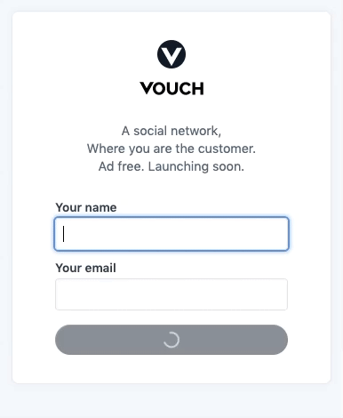
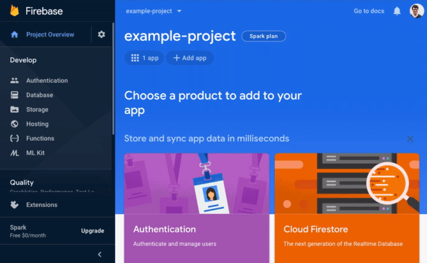

Make Bacon with React & Firebase
================================

This is the companion repository to [React, Firebase & Bacon](https://frontarm.com/bacon) -- a complete guide to building a real-world app with React.

The repository contains branches for individual steps within the course. In the first few sections, you'll create and deploy a small [landing page](https://vouch.chat) -- with hooks, Create React App and Firebase:

<p align="center"></p>

Then, within later steps, you'll add authentication, profiles, payments, modals -- and other features from [vouch.chat](https://beta.vouch.chat).


Outline
-------

*This outline just includes branches in this repository. You can the [full course outline](https://frontarm.com/courses/react-and-bacon/getting-started/welcome/) at [Frontend Armory](https://frontarm.com).*


### 1. Setting up

- [step-010](https://github.com/frontarm/react-firebase-bacon/tree/step-010) – Create an app and deploy it


### 2. Basic hooks and data fetching

- [step-020](https://github.com/frontarm/react-firebase-bacon/tree/step-020) – Fetch and display data with effects
- [step-021](https://github.com/frontarm/react-firebase-bacon/tree/step-021) – Store form state with `useState`


### 3. Forms, errors and state management

- [step-030](https://github.com/frontarm/react-firebase-bacon/tree/step-030) – Submitting forms
- [step-031](https://github.com/frontarm/react-firebase-bacon/tree/step-031) – Human-readable error messages
- [step-032](https://github.com/frontarm/react-firebase-bacon/tree/step-032) – Client-side validation
- [step-033](https://github.com/frontarm/react-firebase-bacon/tree/step-033) – Hiding resolved errors


### 4. Styles and animations

- [step-040](https://github.com/frontarm/react-firebase-bacon/tree/step-040) – Refactor with Styled Components
- [step-041](https://github.com/frontarm/react-firebase-bacon/tree/step-041) – Add the Vouch styles
- [step-042](https://github.com/frontarm/react-firebase-bacon/tree/step-042) – Using images
- [step-043](https://github.com/frontarm/react-firebase-bacon/tree/step-043) – Custom focus styles
- [step-044](https://github.com/frontarm/react-firebase-bacon/tree/step-044) – Add `theme.js`
- [step-045](https://github.com/frontarm/react-firebase-bacon/tree/step-045) – Media queries
- [step-046](https://github.com/frontarm/react-firebase-bacon/tree/step-046) – Filesystem structure
- [step-047](https://github.com/frontarm/react-firebase-bacon/tree/step-047) – Animated loading indicators


### 5. Routing and data subscriptions

- [step-050](https://github.com/frontarm/react-firebase-bacon/tree/step-050) – Browser history and `<Link>` components
- [step-051](https://github.com/frontarm/react-firebase-bacon/tree/step-051) – Simple routing and 404 message
- [step-052](https://github.com/frontarm/react-firebase-bacon/tree/step-052) – Cleaning up after effects
- [step-053](https://github.com/frontarm/react-firebase-bacon/tree/step-053) – A `routes` directory
- [step-054](https://github.com/frontarm/react-firebase-bacon/tree/step-054) – Layout component
- [step-055](https://github.com/frontarm/react-firebase-bacon/tree/step-055) – Programmatic navigation


### 6. Build a backend with Firebase

- [step-060](https://github.com/frontarm/react-firebase-bacon/tree/step-060) – Calling Firebase from React
- [step-061](https://github.com/frontarm/react-firebase-bacon/tree/step-061) – Firebase functions
- [step-062](https://github.com/frontarm/react-firebase-bacon/tree/step-062) – Reduce costs with counters
- [step-063](https://github.com/frontarm/react-firebase-bacon/tree/step-063) – Real-time updates
- [step-064](https://github.com/frontarm/react-firebase-bacon/tree/step-064) – Staging and production builds

You can see the result of this step online at [vouch.chat](https://vouch.chat).


### 7. Authentication

*coming soon*


### 8. Context and advanced hooks

*coming soon*


Installation
------------

If you just want to get the app working without the full walkthrough, here's what to do.


### 1. Firebase app

Before starting, you'll need a Firebase project. Once you've set it up, you'll need your firebase project's config object, which is available in the Firebase console and looks a little like this:

```js
const firebaseConfig = {
  apiKey: "qwertyuiopasdfgh_asdfasdfasdfasdfasdfas",
  authDomain: "something.firebaseapp.com",
  databaseURL: "https://something.firebaseio.com",
  projectId: "something",
  storageBucket: "",
  messagingSenderId: "111111111111",
  appId: "1:111111111111:web:1rstarstarstarst"
};
```

You'll also need to ensure that your project has a *Firestore* database available. To start, you can create it in test mode -- we'll lock it down later.

Here's the full process to configure your Firebase project and Firestore database:

<p align="center"></p>


### 2. Clone and install

Once you've got your Firebase config, start by cloning the repository and installing its dependencies

```bash
git clone https://github.com/frontarm/react-firebase-bacon.git app
cd app
npm install
cd functions
npm install
cd ..
```

### 3. Local configuration files

To actually build and deploy the app, you'll need to create some configuration files:

```bash
cp .env.example .env.development.local
cp .env.example .env.production.local
```

These two files provide configuration for your development server and distributable app, respectively. They start out blank, so you'll need to add the relevant parts from your Firebase config. The end will result will look something like this:

```
// .env files
REACT_APP_FIREBASE_API_KEY=qwertyuiopasdfgh_asdfasdfasdfasdfasdfas
REACT_APP_FIREBASE_AUTH_DOMAIN=something.firebaseapp.com
REACT_APP_FIREBASE_DATABASE_URL=https://something.firebaseio.com
REACT_APP_FIREBASE_PROJECT_ID=something
REACT_APP_FIREBASE_STORAGE_BUCKET=
REACT_APP_FIREBASE_MESSAGING_SENDER_ID=111111111111
REACT_APP_FIREBASE_APP_ID=1:111111111111:web:1rstarstarstarst
```

You'll also need to add a `functions/.serviceaccount.json` file, which includes credentials for your *development* Firebase service account -- needed to test your Firebase functions locally. You can download the contents of this file from the Firebase console:

<p align="center"></p>

Once you've downloaded the service account file, just move it into your `functions` directory and rename it to `.serviceaccount.json`.

All of these configuration files are listed in `.gitignore`, so you don't need to worry about accidentally pushing any private configuration to a public repository.


### 4. Start the dev server

You can test your configuration by starting the development server:

```bash
npm run start:client
```

This should open a browser window to <http://localhost:3000/>, where if everything has gone to plan, you'll see the landing page. However, before being able to submit the form, you'll first need to start a server to simulate your Firebase functions locally.


### 5. Set up the Firebase CLI tools

Before continuing, you'll first need to make sure you have the Firebase CLI tools installed:

```bash
npm install -g firebase-tools
```

Once installed, you'll also need to login to your Firebase account:

```bash
firebase login
```

This will give you a `firebase` command, which lets you deploy your app to Firebase hosting, deploy Firebase functions, and run Firebase functions locally.


### 6. Create your `.firebaserc` file

In order to know which Firebase project to use, the `firebase` command looks for the current project's ID in a file could `.firebaserc` -- which you'll need to create. The easiest way to do this is by running `firebase use --add`, selecting a project, and then naming it `default` when prompted:

```
$ firebase use --add

? Which project do you want to add? vouchchat
? What alias do you want to use for this project? (e.g. staging) default

Created alias default for vouchchat.
Now using alias default (vouchchat)
```


### 7. Start the local Firebase functions server

Once you've set up the Firebase CLI tools, you can start a local server in a separate terminal window to simulate your Firebase functions:

```bash
npm run start:functions
```

If this has worked correctly, then you should now be able to submit the form on your landing page!

You'll usually want both the React and Firebase dev servers running simultaneously, so this repository also includes a special script that will start both of them in the same tab:

```bash
npm start
```


### 8. Deploy!

Once you've completed all of the earlier steps, deploying your app to the internets is simple:

```bash
npm run build:development # or npm run build:production
firebase deploy
```

This will build your app's distributable files with the `react-scripts` command, before calling `firebase deploy` to upload the new app to Firebase hosting, deploy cloud functions, and lock down your database's access rules. Once complete, your new app's URL will be printed to the console.

If everything is set up correctly, you should now be able to submit the form in the live app with another email address, and see it appear in your Firebase console after a refresh. Congratulations -- you've got your landing page working! All that's left is to play with the styles to make it work for your brand.


### 9. Bonus step: add a domain

Within the [Firebase Console](https://console.firebase.google.com)'s *Hosting* area, you can add a domain name for your landing page -- so that it looks a little more official.


How does this all work though?
------------------------------

Want to build real apps that make real bacon? Then check out [React, Firebase & Bacon](https://frontarm.com/bacon) -- and while you're there, pick up a free CLI cheatsheet with many of the commands from this guide. I'll see you there!

*- James K Nelson*


License
-------

Code is licensed under the MIT license. Images are not licensed.